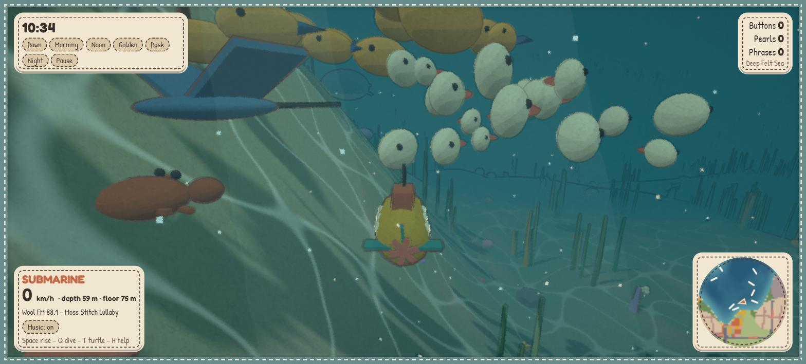
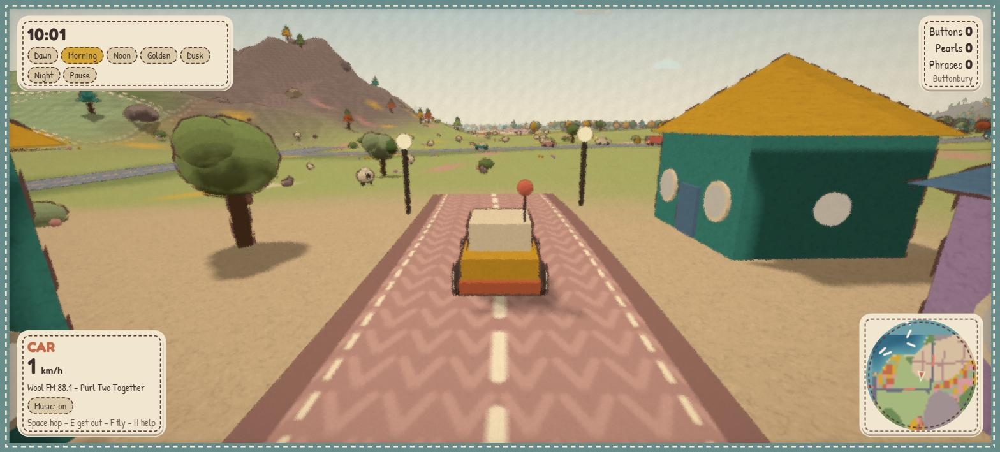
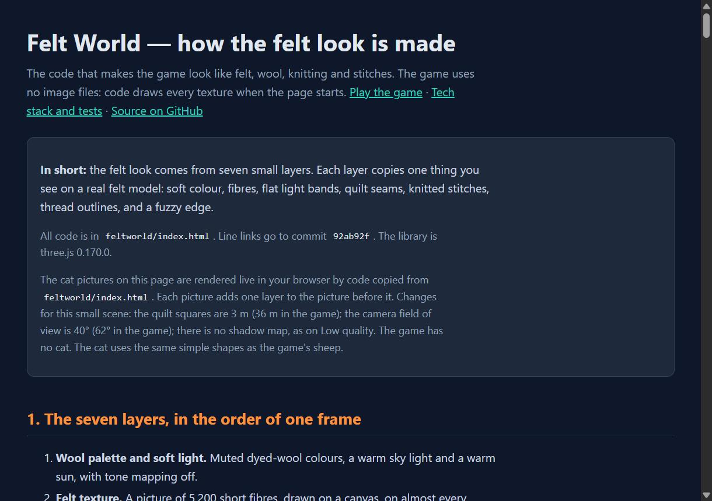
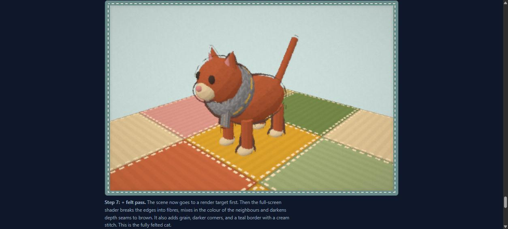

# Felt World

An open-world game in one HTML file. The world looks like a needle-felted and yarn diorama. You can drive, walk, fly as a felt bird, and dive under the sea in a submarine or as a sea turtle.

Claude Code with the Opus 5.5 model wrote all the code. There are no image files and no audio files. Every texture is drawn on a `<canvas>` and every sound is made with Web Audio.

## ▶ Play

**[Play Felt World in your browser](https://az9713.github.io/opus-5.5-open-world-game/feltworld/)**

1. Open the link in a desktop browser. Chrome is the browser used for the tests.
2. Click **Start**.
3. Press **H** to see the controls.

On a phone, turn the phone sideways. Touch controls show automatically.

The game needs an internet connection at start, because it loads three.js from the jsDelivr CDN and two fonts from Google Fonts.

How the game is built and tested: **[Tech stack and physics tests](https://az9713.github.io/opus-5.5-open-world-game/tech-stack.html)** (source: [`tech-stack.html`](tech-stack.html)).

## Screenshots

The three worlds, on High quality, at 10:00 in the morning.

**In the air** — the felt bird over meadows, a road with traffic, and a knit-row mountain:


**Under water** — the submarine in the Deep Felt Sea with a ray, a crab, a fish school, kelp and light patterns on the sea floor:



**On land** — the car on a knitted town street in Buttonbury, with felt houses, trees and street lamps:



## How the felt look is made

**[Open the live page: How the felt look is made](https://az9713.github.io/opus-5.5-open-world-game/felt-effects.html)** (source: [`felt-effects.html`](felt-effects.html))

The felt look comes from seven small layers: a wool palette, a canvas-drawn fibre texture, a 4-step toon ramp, quilt and knit patterns in the shaders, knitted road textures, running-stitch outlines, and a post-process pass that frays edges into fibres. The page explains each layer with its numbers and links to the code lines. It also shows a felt cat that gets one layer more in each section, from a plain three.js cat (step 0) to the fully felted cat (step 7).

GitHub does not run a web page inside a README, so the two pictures below are screenshots of the documentation page. They are not screenshots of the game. Click a picture to open the live page.

The top of the documentation page:

[](https://az9713.github.io/opus-5.5-open-world-game/felt-effects.html)

Step 7 of the felt-cat demonstration on that page. The cat is a demonstration scene for the page, drawn in your browser with the game's felt code. **The game has no cat.** The teal stitched frame is the same border that the game's felt pass draws round the screen:

[](https://az9713.github.io/opus-5.5-open-world-game/felt-effects.html#felt-pass)

## Inspiration

- The YouTube video [*OPUS 5.5 Built this OPEN WORLD GAME in one PROMPT!!*](https://www.youtube.com/watch?v=u0LRYgON3Ug) (channel: Code Bear) shows **Paper World**, an ink-and-paper open-world driving game made with Opus 5.5 in one HTML file.
- The source code of that game is at [github.com/aadil6971/PaperWorld](https://github.com/aadil6971/PaperWorld).

Felt World uses the same class of techniques: a world made from pure functions of (x, z), chunk streaming, instanced props, crowds of agents, and a look-ahead Web Audio scheduler. Paper World has no licence, so no code was copied from it. All the code in this repository is new.

## How the requests made this game different

The game was built from a sequence of requests in Claude Code. Each request below changed the game away from Paper World.

| Request | Result in Felt World | Paper World |
|---|---|---|
| "What can be beyond paper and ink but still visually comforting?" → felt and yarn | Toon shading with a soft ramp, running-stitch outlines, wool-fibre fuzz and felt grain in a post shader, a stitched fabric border, pom-pom trees, felt houses with button windows, knitted roads | Ink outlines, watercolour wobble, paper grain, torn-paper frame |
| Add an underwater world with 2 ways to move (A + B) | Deep sea basins, shallows and coasts. **A:** the car becomes a submarine in deep water and a car again on the shore. **B:** press T in water to become a sea turtle | No underwater world |
| Make the game playable on a phone | Joystick, action buttons, drag to look, pinch to zoom, Low / Medium / High quality | Has its own touch controls and an installable app (PWA) |
| Fix: diving into water did not go under water | The sea entry was fixed | — |
| Fix pause; add a button to turn off music | P pauses the whole game; a Music button turns the radio off | — |
| "The underwater world needs more living organisms" | Fish schools, jellyfish, rays, sea turtles, crabs, whales, starfish, urchins, kelp, coral, a shipwreck and a treasure chest | Sky whales, land animals |
| "How do I know how deep I am?" | The HUD shows `depth N m · floor N m` in and on the sea. Whales live only where the floor is deeper than 40 m | — |
| "Physics is violated" (a van under a floating road, a van inside another van) | A full physics pass for every world, plus an automatic physics test with 150 checks and 9 injected faults. See [Physics test](#physics-test) | — |

Paper World has more content in some areas. Felt World has 8 landmark types (windmill, lighthouse, barn, clock tower, bandstand, giant yarn ball, shipwreck, treasure chest) where Paper World has 46. Felt World has one flight mode (felt bird) where Paper World has two (paper plane and eagle). Felt World has no rain, no photo mode and no installable app.

## Controls

| Key | Action |
|---|---|
| W A S D / arrows | Drive, walk, swim, fly |
| Space | Hop (car) / jump (walk) / rise (water) / flap (bird) |
| Q | Dive (submarine, turtle); while swimming, dive under as a turtle |
| Shift | Run (walk) / boost (fly, swim) |
| E | Get out of / into a vehicle |
| F | Turn into a felt bird / land |
| T | Turn into a sea turtle in water / change back |
| C | Cycle camera; drag = orbit, wheel = zoom |
| R / N | Radio on-off / next song |
| P | Pause / play |
| H | Help |

Drive into deep water and the car becomes a submarine. Drive out onto a shore and it becomes a car again. Collect the felt buttons along the roads to play note phrases.

## Run it on your own computer

There is no build step. Serve the `feltworld/` folder with any static web server:

```bash
cd feltworld
python -m http.server 8431
```

Then open `http://localhost:8431/`. Opening `index.html` as a `file://` URL does not work, because the page is an ES module.

## Physics test

`feltworld/physics-check.js` tests the physics inside the running game. It uses the drawn terrain and road meshes as the reference, not the game's own height code.

1. Open the game and click **Start**.
2. Open the browser console (F12).
3. Load the test:
   ```js
   const m = await import(new URL('physics-check.js?' + Date.now(), location.href));
   ```
4. Run the checks. Every `fails` value must be 0. The run takes 25–45 s and blocks the page.
   ```js
   console.table(await m.run());
   ```
5. Run the fault injection. Every row must say `caught: true`.
   ```js
   console.table(await m.faults());
   ```
6. Run a 90 s traffic soak. `overlaps` and `deadlocks` must be 0:
   ```js
   m.soak('town');
   ```
7. Check that moving things do not pass through each other (cars, walkers, sheep, rabbits, sea animals, the submarine). Every `bad` must be 0:
   ```js
   for (const b of ['town', 'field', 'sea']) console.table(m.overlaps(b));
   ```

What the test covers, the results, and what is **not** tested are in [`tech-stack.html`](tech-stack.html).

## Files

| File | What it is |
|---|---|
| `feltworld/index.html` | The whole game: 3,231 lines, HTML + CSS + one JavaScript module |
| `feltworld/physics-check.js` | The in-browser physics test |
| `tech-stack.html` | Tech stack, physics design, and the test report |
| `felt-effects.html` | How the felt look is made in code |
| `screenshots/` | The screenshots in this README: three of the game (`air`, `underwater`, `land`) and two of the documentation page (`felt-effects-*`) |

## License

[MIT](LICENSE)
